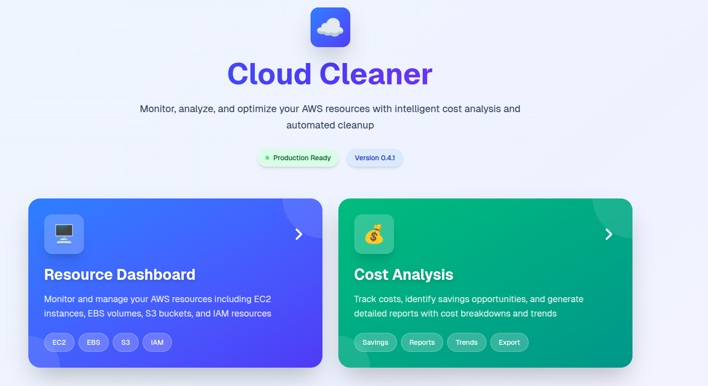

# Cloud Cleaner Dashboard

A comprehensive AWS resource management dashboard for identifying and tracking unused cloud resources to optimize costs. Built with Python 3.13, Docker, and modern web technologies.



## ✨ Features

### 🔍 Resource Monitoring
- **🖥️ EC2 Instance Monitoring**: Track stopped EC2 instances across all regions
- **💾 EBS Volume Management**: Identify unattached EBS volumes across all regions
- **🪣 S3 Bucket Analysis**: Find unused or empty S3 buckets (global)
- **🔐 IAM Role Auditing**: Detect unused IAM roles with usage analysis
- **👥 IAM User Auditing**: Monitor inactive IAM users with activity tracking
- **🔑 Access Key Monitoring**: Track unused access keys with security risk assessment
- **🌐 Multi-Region Scanning**: Comprehensive analysis across all AWS regions

### 💰 Cost Analysis & Reporting
- **💵 Cost Estimation**: Calculate potential savings for unused resources
- **📊 Cost Breakdown**: Visualize costs by resource type with beautiful gradient cards
- **💡 Savings Calculator**: Interactive calculator showing daily, monthly, and yearly savings
- **📈 Resource-specific Costs**: Detailed cost analysis per resource type (EC2, EBS, S3, IAM)
- **📄 PDF Reports**: Generate professional PDF reports with cost analysis
- **📊 CSV Export**: Export resource and cost data for external analysis
- **🎨 Professional UI**: Stunning gradient design matching modern SaaS applications

### 📊 Dashboard & UI
- **Real-time Dashboard**: Modern React-based frontend with live data and stunning gradients
- **Advanced Filtering**: Search and filter resources by region, status, and metadata
- **Resource Details**: In-depth view with policies, tags, and usage history
- **Safe Delete Operations**: Force cleanup options for dependent resources
- **Security Assessment**: Highlight high-risk resources (active unused access keys)
- **Professional Design**: Beautiful gradient backgrounds, smooth animations, and modern UI components

### 🔔 Notifications & Alerts
- **🔔 Slack Integration**: Real-time alerts with regional breakdown
- **📧 Email Reports**: Detailed HTML reports with professional formatting
- **⏰ Scheduled Scans**: Automated monitoring with Celery Beat scheduler
- **📊 Resource Aggregation**: Comprehensive reporting with estimated savings

### ⚙️ Backend & API
- **RESTful API**: FastAPI backend with comprehensive endpoints
- **Redis Caching**: Improved performance with intelligent caching
- **Celery Integration**: Asynchronous task processing for scheduled scans
- **Error Handling**: Graceful error handling with detailed messages
- **Health Monitoring**: Built-in health checks for all services

## 🚀 Quick Start

### Prerequisites
- Docker and Docker Compose installed
- AWS Account with appropriate credentials
- Redis server (auto-included with Docker)

### 1. Clone & Configure
```bash
git clone <repository-url>
cd cloud-cleaner-dashboard

# Configure AWS credentials
cp .env.example .env
# Edit .env with your AWS credentials and notification settings
```

### 2. Start Services
```bash
docker-compose up -d
```

### 3. Access Dashboards
- **Resource Dashboard**: [http://localhost:3000/dashboard](http://localhost:3000/dashboard)
- **Cost Analysis Dashboard**: [http://localhost:3000/cost-analysis](http://localhost:3000/cost-analysis)
- **Backend API**: [http://localhost:8084](http://localhost:8084)
- **API Docs**: [http://localhost:8084/docs](http://localhost:8084/docs)

That's it! The dashboard will automatically scan your AWS resources and display them in the UI.

## 📚 Documentation

### 📋 [Documentation Index](docs/README.md)
Complete documentation index with navigation and architecture overview.

## 📋 Documentation Navigation

### 🚀 [Setup Guide](docs/setup.md)
Complete installation and setup instructions
- **Docker Quick Start**: One-command deployment
- **Local Development**: Manual setup for development
- **Production Deployment**: Production-ready configuration
- **Environment Configuration**: All required environment variables

### 🔧 [Configuration Guide](docs/configuration.md)
Detailed configuration reference
- **Environment Variables**: Complete reference for all settings
- **AWS Permissions**: Required IAM permissions and security best practices
- **Notification Setup**: Slack and Email configuration
- **Redis Configuration**: Caching and task queue setup
- **Security Settings**: Production security hardening

### 📡 [API Documentation](docs/api.md)
Complete API reference with examples
- **Resource Endpoints**: EC2, EBS, S3, IAM API endpoints
- **Cost Analysis Endpoints**: Cost estimation and reporting APIs
- **Schedule Endpoints**: Automated scanning configuration
- **Notification Endpoints**: Alert and notification APIs
- **Export Endpoints**: PDF and CSV report generation
- **Request/Response Examples**: Detailed examples for all endpoints
- **Error Handling**: Error responses and status codes

### ⏰ [Scheduled Scanning](docs/scheduled-scanning.md)
Automated monitoring and alerts
- **Celery Beat Setup**: Background task scheduling
- **Configuration Options**: Frequency and notification settings
- **Multi-Region Scanning**: Comprehensive AWS region coverage
- **Security Monitoring**: Access key risk assessment
- **Troubleshooting**: Common issues and solutions

### 📱 [Using the Dashboard](docs/usage.md)
Step-by-step usage guide
- **Dashboard Navigation**: Interface overview and navigation
- **Resource Management**: Filtering, searching, and managing resources
- **Cost Analysis**: Understanding cost breakdowns and savings opportunities
- **Report Generation**: Creating PDF and CSV reports
- **Alert Panel**: Sending notifications and reports
- **Schedule Settings**: Configuring automated scanning
- **Best Practices**: Security and cost optimization tips

### 🔔 [Notifications Setup](docs/NOTIFICATIONS_SETUP.md)
Detailed instructions for configuring Slack and Email notifications.

## 🏗️ Architecture

### Backend (FastAPI + Python 3.13)
- **Modular Design**: Separate modules for each AWS service
- **Centralized AWS Client**: Single factory pattern for boto3 clients
- **Redis Integration**: Caching and task queue management
- **Celery Workers**: Background task processing for scheduled scans

### Frontend (Next.js 14 + TypeScript)
- **Server-Side Rendering**: Next.js 14 with App Router
- **Component Architecture**: Reusable, maintainable components
- **Real-time Updates**: Live data refresh with progress feedback
- **Responsive Design**: Mobile-first approach with Tailwind CSS

### Infrastructure
- **Redis**: Task queue and caching layer
- **Celery Beat**: Scheduled task management
- **Docker Compose**: Complete service orchestration
- **Health Checks**: Comprehensive monitoring and alerting

## 🔧 Development

### Local Setup
```bash
# Backend
cd backend
python -m venv venv
source venv/bin/activate
pip install -r requirements.txt
python main.py

# Celery Worker (Terminal 2)
./start_celery_worker.sh

# Celery Beat (Terminal 3)
./start_celery_beat.sh

# Frontend (Terminal 4)
cd frontend
npm install
npm run dev
```

### Testing
```bash
# Backend tests
cd backend
pytest

# Frontend tests
cd frontend
npm test

# Code quality
flake8 .  # Backend
npm run lint  # Frontend
```

## 🛡️ Security

### AWS Permissions
The application requires read-only permissions for AWS resource monitoring:

```json
{
  "Version": "2012-10-17",
  "Statement": [
    {
      "Effect": "Allow",
      "Action": [
        "ec2:DescribeInstances",
        "ec2:DescribeVolumes",
        "s3:ListAllMyBuckets",
        "s3:GetBucketLocation",
        "iam:ListRoles",
        "iam:GetRole",
        "iam:ListUsers",
        "iam:ListAccessKeys",
        "iam:GetAccessKeyLastUsed"
      ],
      "Resource": "*"
    }
  ]
}
```

### Security Best Practices
- Use IAM roles instead of access keys when possible
- Enable Multi-Factor Authentication for AWS console
- Restrict notification recipients to authorized users
- Use environment-specific AWS credentials
- Enable CloudTrail for audit logging

## 📊 Project Structure

```
cloud-cleaner-dashboard/
├── backend/                    # FastAPI backend
│   ├── api/                   # API endpoints
│   │   ├── ec2.py            # EC2 resource endpoints
│   │   ├── ebs.py            # EBS volume endpoints  
│   │   ├── iam.py            # IAM user/role endpoints
│   │   └── notifications.py  # Notification endpoints
│   ├── core/                 # Core functionality
│   │   ├── aws_client.py     # AWS client factory
│   │   ├── celery_app.py     # Celery configuration
│   │   └── cache.py          # Redis caching
│   └── main.py               # FastAPI application
├── frontend/                  # Next.js frontend
│   ├── src/app/             # Next.js pages
│   │   ├── dashboard/       # Resource dashboard
│   │   └── cost-analysis/   # Cost analysis dashboard
│   ├── src/components/      # React components
│   └── src/hooks/          # Custom React hooks
├── docs/                     # Documentation
│   ├── README.md           # Documentation index
│   ├── setup.md            # Installation guide
│   ├── api.md              # API documentation
│   ├── configuration.md    # Configuration guide
│   ├── scheduled-scanning.md # Automation guide
│   ├── usage.md            # Dashboard usage guide
│   └── NOTIFICATIONS_SETUP.md # Notification setup
├── docker-compose.yml        # Service orchestration
├── LICENSE.md                # MIT License
└── README.md                 # This file
```

## 🤝 Contributing

1. Fork the repository
2. Create a feature branch (`git checkout -b feature/amazing-feature`)
3. Commit your changes (`git commit -m 'Add amazing feature'`)
4. Push to the branch (`git push origin feature/amazing-feature`)
5. Open a Pull Request

## 📄 License

MIT License - see [LICENSE.md](LICENSE.md) file for details.

## 🆘 Support & Troubleshooting

### Common Issues

**🔧 Setup Issues**
- Ensure Docker is running: `docker --version`
- Check Redis connectivity: `redis-cli ping`
- Verify AWS credentials: `aws sts get-caller-identity`

**🔍 API Issues**
- Check backend logs: `docker-compose logs backend`
- Verify API connectivity: `curl http://localhost:8084/health`
- Test AWS permissions: Use the API docs at `/docs`

**⏰ Scheduling Issues**
- Check Celery worker: `docker-compose logs celery-worker`
- Verify Redis queue: `redis-cli KEYS *`
- Test manual trigger: `POST /api/schedule/trigger`

### Getting Help

1. **Check the [Setup Guide](docs/setup.md)** for installation issues
2. **Review the [API Documentation](docs/api.md)** for endpoint questions  
3. **See [Configuration Guide](docs/configuration.md)** for setup problems
4. **Check logs**: `docker-compose logs -f`
5. **Open an issue** on GitHub with logs and error messages

### Logging

```bash
# View all service logs
docker-compose logs -f

# View specific service logs
docker-compose logs -f backend
docker-compose logs -f frontend
docker-compose logs -f celery-worker
docker-compose logs -f celery-beat
```

## 🔄 Changelog

**See [RELEASES.md](RELEASES.md) for detailed release notes and version history.**


---

**Built with ❤️ for better AWS resource management**

[](https://github.com/abhishekpanda0620/cloud-cleaner-dashboard)
[](https://github.com/abhishekpanda0620/cloud-cleaner-dashboard)